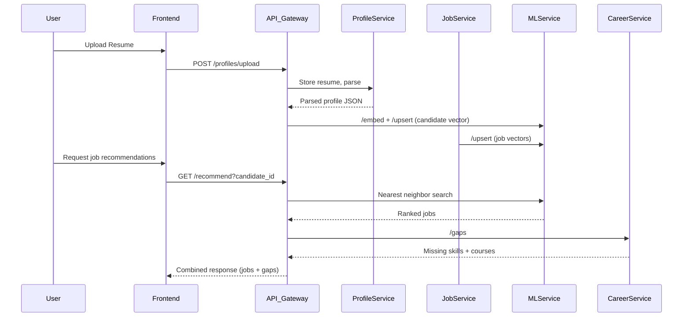
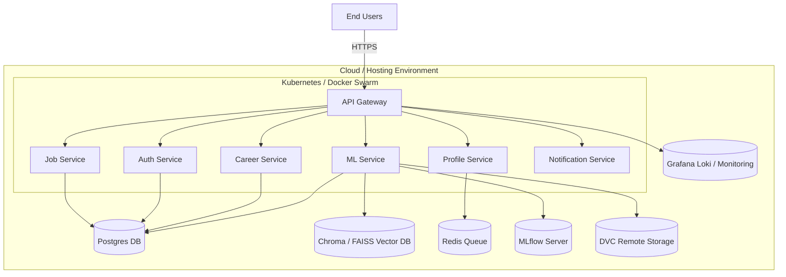
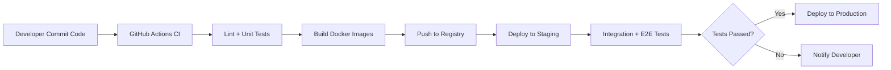

# AI Job Matching Platform 

---

## Architecture Diagram (Mermaid)

```mermaid
flowchart TD
  %% Layout
  subgraph UserLayer[User / Client]
    A[Browser]
  end

  subgraph CDN_Frontend[CDN / Frontend Hosting]
    F[Vercel (Frontend)]
  end

  subgraph APIGW[API Gateway]
    GW[API Gateway (Laravel)]
  end

  subgraph Services[Microservices Cluster]
    Auth[Auth Service - JWT/OAuth]
    Profile[User Profile Service - Resume upload & parse]
    JobSvc[Job Service - CRUD + job metadata]
    ML[ML Matching Service - FastAPI + embeddings]
    Career[Career Rec Service - Skill-gap + courses]
    Notify[Notification Service - Email / Push]
  end

  subgraph DataLayer[Data & Infra]
    DB[(MySQL)]
    Vector[(Pinecone)]
    DVCStorage[(DVC Remote / S3 / Git LFS)]
    MLflow[(MLflow Tracking Server)]
    Redis[(Redis Queue / Cache)]
    Logs[(Grafana Loki / Cloud Logs)]
  end

  A -->|HTTPS| F
  F -->|HTTPS| GW

  GW --> Auth
  GW --> Profile
  GW --> JobSvc
  GW --> ML
  GW --> Career
  GW --> Notify

  Profile -->|enqueue| Redis
  Profile --> ML
  JobSvc --> ML
  ML --> Vector
  ML --> DB
  Career --> DB
  Career --> ML

  Auth --> DB
  JobSvc --> DB
  Profile --> DB

  ML -->|metrics & experiments| MLflow
  ML -->|datasets & artifacts| DVCStorage

  GW --> Logs
  ML --> Logs
  JobSvc --> Logs
  Profile --> Logs

  Redis -->|task queue| Profile
```

---

## Sequence Diagram: Job Matching Flow



---

## Deployment Diagram



---

## CI/CD Pipeline Flow



---

## One-line System Description

A microservice-based, modular platform that ingests candidate CVs, extracts structured profiles, indexes both candidate and job embeddings into a vector store, returns ranked job matches, computes skill gaps, and suggests personalized learning paths (free + paid) — all with reproducible MLOps and CI/CD.

---

## Microservices & Responsibilities

1. **API Gateway / BFF** — Entry point, JWT validation, orchestration.
2. **Auth Service** — Users, roles, tokens, SSO.
3. **User Profile Service** — Resume upload, parsing, embedding enqueue.
4. **Job Service** — CRUD jobs, metadata, embeddings.
5. **ML Matching Service** — Embeddings, vector store, recommendations.
6. **Career Recommendation Service** — Skill gaps + course mapping.
7. **Notification Service** — Email, SMS, push notifications.
8. **Infrastructure** — DB, vector store, Redis, DVC, MLflow, monitoring.

---

## API Contracts

* **Auth**: `/auth/register`, `/auth/login`
* **Profile**: `/profiles/upload`, `/profiles/:id`
* **Jobs**: `/jobs`, `/jobs/:id`
* **ML**: `/embed`, `/upsert`, `/recommend`, `/explain`
* **Career**: `/gaps`
* **Admin**: `/admin/reindex`

---

## Database Schema

Core tables: `users`, `candidates`, `jobs`, `skills`, `job_skills`, `recommendations`.

---

## Repo Layout

```
/ai-job-matching-platform
├─ /frontend          
├─ /backend           
├─ /ml_service        
├─ /ml                
├─ /infra             
├─ /scripts           
├─ /docs              
└─ .github/workflows  
```

---

## docker-compose

Includes Mysql, Redis, Pinecone, ML Service, Backend.

---

## Starter ML Service (FastAPI)

Minimal app with `/embed`, `/upsert`, `/recommend` endpoints using `sentence-transformers` + Pinecone.

---

## Quickstart

1. Clone repo
2. Setup `.env`
3. `docker-compose up --build`
4. Access backend (8002), ML service (8001).

---

## CI/CD

GitHub Actions: lint, test, build, deploy.

---

## MLOps

* DVC for datasets & artifacts
* MLflow for tracking experiments
* Eval metrics: Precision, Recall

---

## Monitoring

Grafana, Prometheus, Loki. Track latency, errors, embedding performance.

---

## Security

HTTPS, encryption, masked logs, rate limits, rotated credentials.

---

## Contribution & License

* `MIT` or `Apache-2.0`
* Contributing guidelines
* Contact info
